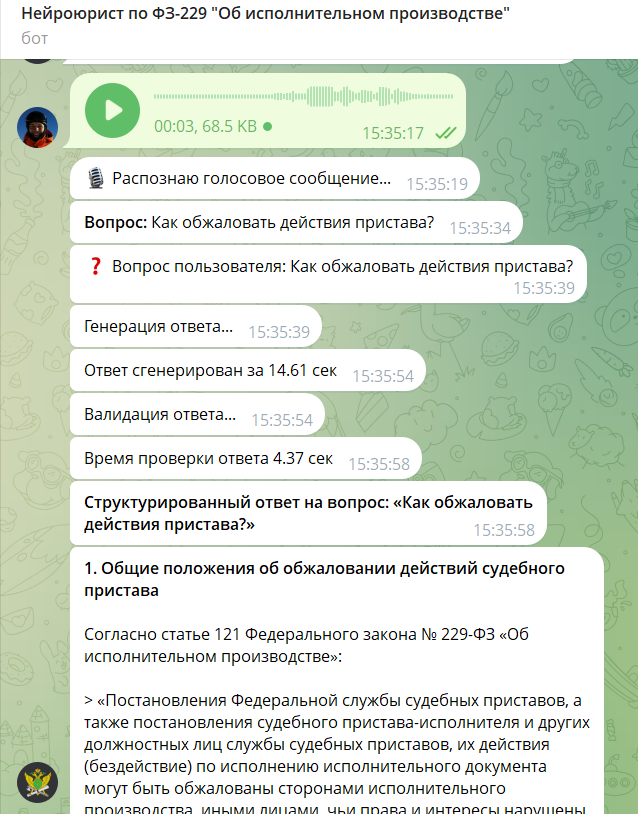

# ⚖️ Нейроюрист по ФЗ-229 "Об исполнительном производстве" (RAG AI Assistant)

**Нейроюрист** — это production-ready Telegram-бот на базе RAG-архитектуры, созданный для предоставления точных юридических консультаций по Федеральному закону №229-ФЗ «Об исполнительном производстве». 

## 🎯 Главная фича: Уровень галлюцинаций = 0%
Основная проблема современных LLM в юриспруденции — неточное цитирование закона,выдумывание несуществующих статей. В данном проекте эта проблема решена **многошаговой логикой** в купе с семантическим чанкингом (`MarkdownHeaderTextSplitter`). Нейроюрист показывает хорошую производительность на домашнем компьютере с GPU RTX 3060 12gb. Время ожидания ответа нейроюриста от 20 секунд до минуты.

## ⚙️ Архитектура и стек технологий
* **Telegram Interface:** `aiogram 3.x` (Асинхронная обработка, FSM-состояния, Inline/Reply клавиатуры).
* **Voice Recognition:** `OpenAI Whisper` (Модель *turbo* для транскрибации голосовых сообщений юристов/клиентов на лету).
* **Vector Store & Embeddings:** `FAISS` + `BGE-M3` (Локальное хранилище, высокая релевантность поиска на русском языке).
* **LLM Engine:** Локальный инференс модели `Qwen3-4B-2507` на платформе windows+через LM Studio. Архитектура совместима с Linux+Ollama.
* **RAG Pipeline:** `LangChain`.

## 🧠 Как работает многошаговая логика (Пайплайн)
При получении запроса (текстом или голосом) бот выполняет следующие независимые LLM-вызовы:
1. **Анализатор (Classifier & Extractor):** Декомпозирует вопрос, извлекает стороны (взыскатель/должник), тип ситуации и ключевые факты. Фильтрует off-topic вопросы.
2. **Генератор (Generator):** Формирует структурированный ответ со строгим цитированием на основе найденных в FAISS чанков.
3. **Валидатор (Self-Check Evaluator):** Независимая проверка (T=0.01). Ищет противоречия, проверяет существование процитированных статей. Если найдена неточность — генерация отправляется на доработку.
4. **Доработка неточностей**

## 🚀 Особенности реализации
- **Dynamic Chunking:** База ФЗ-229 (367 тыс. символов) разбита не по количеству токенов, а по семантической структуре закона (Глава -> Статья), что сохраняет юридический контекст.
- **Audio Processing:** Автоматическая конвертация .ogg (Telegram) в .wav через `ffmpeg` для идеальной работы голосового ввода с Whisper.
- **Asynchronous Execution:** Тяжелые LLM-вызовы и транскрибация обернуты в `asyncio.to_thread`, чтобы не блокировать event-loop бота.

## 👨‍💻 Автор
**Maksim Goryachev**
Full-Stack AI / ML Engineer
